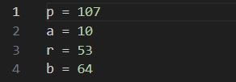
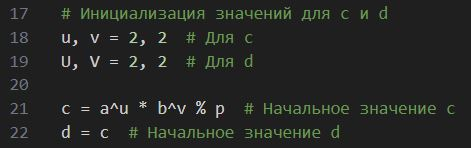
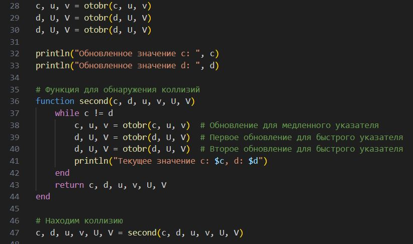
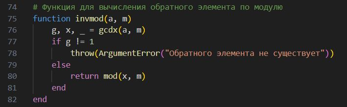
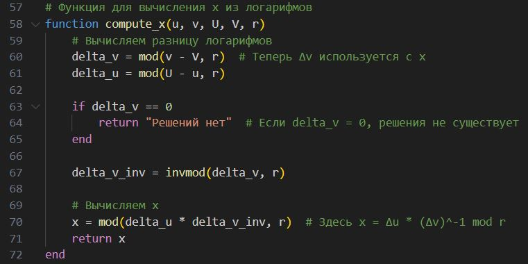
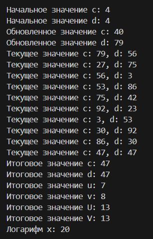

---
## Front matter
lang: ru-RU
title: Математические основы защиты информации и информационной безопасности
author: Супонина Анастасия Павловна
institute: 
    - РУДН, Москва, Россия

date: 
    - 5 Октября 2024

## Formatting
## i18n babel
babel-lang: russian
babel-otherlangs: english

## Formatting pdf
toc: false
toc-title: Содержание
slide_level: 2
aspectratio: 169
section-titles: true
theme: metropolis
header-includes:
 - \metroset{progressbar=frametitle,sectionpage=progressbar,numbering=fraction}
---

## Лабораторная работа 7

### Цель работы

Ознакомиться с дискретным логарифмированием и научиться выполнять его программно при помощи p-метод Полларда.

### Задание

Реализовать p-метод Полларда для дискретного логарифмирования на языке программирования Julia.

## Алгоритм, реализующий p–Метод Полларда для задач дискретного логарифмирования - 1 этап.

Вход. Простое число p, число a порядка r по модулю p, целое число b, 1 < b < p; отображение f, обладающее сжимающими свойствами и сохраняющее вычислимость логарифма.

Для с и для d значения u, v присваиваю разные для счета.

## Алгоритм - 2 этап - нахождения отображения.

Для начала отдельно создаю функцию, которая будет считать отбражение, а также увеличивать значения u, v на 1 на каждом шаге. 

## Алгоритм - 2 этап - нахождение коллизии.

Таким образом ищу коллизии.

## Алгоритм - 3 этап - функция нахождения обратного значения.

Создаю функцию для вычисления обратного элемента, чтобы потом вычислить значение х.

## Алгоритм - 3 этап - функция дляя решения логарифмов и нахождения значения х.

## Результат

# Выводы

В процессе выполнения работы, я реализовала алгоритм p-Полларда для задач дискретного логарифмирования на языке программирования Julia.

