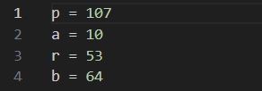
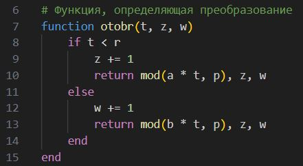
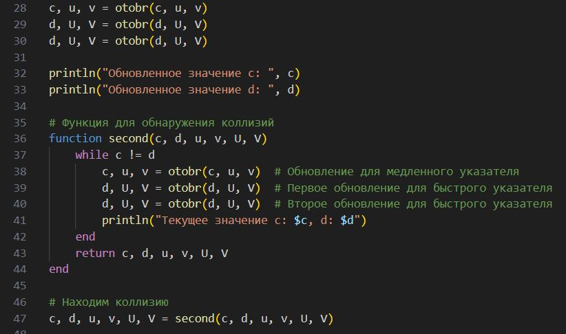
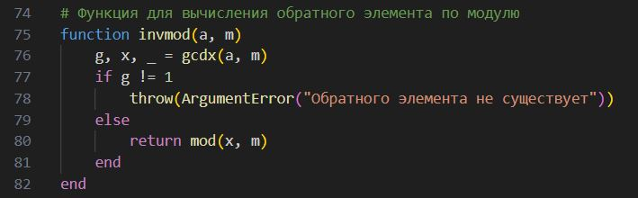
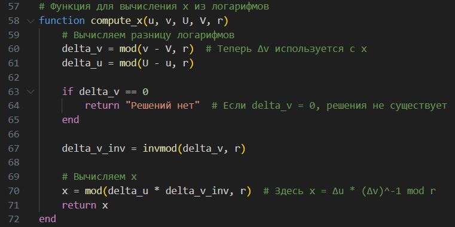

---
## Front matter
title: "Отчёт по лабораторной работе 7"
author: "Супонина Анастасия Павловна"

## Generic otions
lang: ru-RU
toc-title: "Содержание"

## Bibliography
bibliography: bib/cite.bib
csl: pandoc/csl/gost-r-7-0-5-2008-numeric.csl

## Pdf output format
toc: true # Table of contents
toc-depth: 2
lof: true # List of figures
lot: true # List of tables
fontsize: 12pt
linestretch: 1.5
papersize: a4
documentclass: scrreprt
## I18n polyglossia
polyglossia-lang:
  name: russian
  options:
  - spelling=modern
  - babelshorthands=true
polyglossia-otherlangs:
  name: english
## I18n babel
babel-lang: russian
babel-otherlangs: english
## Fonts
mainfont: IBM Plex Serif
romanfont: IBM Plex Serif
sansfont: IBM Plex Sans
monofont: IBM Plex Mono
mathfont: STIX Two Math
mainfontoptions: Ligatures=Common,Ligatures=TeX,Scale=0.94
romanfontoptions: Ligatures=Common,Ligatures=TeX,Scale=0.94
sansfontoptions: Ligatures=Common,Ligatures=TeX,Scale=MatchLowercase,Scale=0.94
monofontoptions: Scale=MatchLowercase,Scale=0.94,FakeStretch=0.9
mathfontoptions:
## Biblatex
biblatex: true
biblio-style: "gost-numeric"
biblatexoptions:
  - parentracker=true
  - backend=biber
  - hyperref=auto
  - language=auto
  - autolang=other*
  - citestyle=gost-numeric
## Pandoc-crossref LaTeX customization
figureTitle: "Рис."
tableTitle: "Таблица"
listingTitle: "Листинг"
lofTitle: "Список иллюстраций"
lotTitle: "Список таблиц"
lolTitle: "Листинги"
## Misc options
indent: true
header-includes:
  - \usepackage{indentfirst}
  - \usepackage{float} # keep figures where there are in the text
  - \floatplacement{figure}{H} # keep figures where there are in the text
---

# Цель работы

Ознакомиться с дискретным логарифмированием и научиться выполнять его программно при помощи p-метод Полларда.

# Задание

Реализовать p-метод Полларда для дискретного логарифмирования на языке программирования Julia.

# Теоретическое введение
  
## Дискретное логарифмирование в конечном поле

Задача дискретного логарифмирования, как и задача разложения на множители, применяется во многих алгоритмах криптографии с открытым ключом. Предложенная в 1976 году У. Диффи и М. Хеллманом для установления сеансового ключа, эта задача послужила основой для создания протоколов шифрования и цифровой подписи, доказательств с нулевым разглашением и других криптографических протоколов.

Пусть над некоторым множеством Ω произвольной природы определены операции сложения «+» и умножения «·». Множество Ω называется кольцом, если выполняются следующие условия:

1. Сложение коммутативно: $ a + b = b + a $ для любых $ a, b ∈ Ω $;  
2. Сложение ассоциативно: $ (a + b) + c = a + (b + c)$ для любых $a, b, c ∈ Ω$;  
3. Существует нулевой элемент $0 ∈ Ω$ такой, что $a + 0 = a$ для любого $a ∈ Ω$;  
4. Для каждого элемента $a ∈ Ω $ существует противоположный элемент $–a ∈ Ω$, такой, что $(–a) + a = 0$;  
5. Умножение дистрибутивно относительно сложения:  
   
   $ a · (b + c) = a · b + a · c,  (a + b) · c = a · c + b · c,  $
   
   для любых $a, b, c ∈ Ω$.

Если в кольце $ Ω $ умножение _коммутативно_: $ a · b = b · a $ для любых $a, b ∈ Ω$, то кольцо называется коммутативным.

Если в кольце $Ω$ умножение _ассоциативно_: $(a · b) · c = a · (b · c)$ для любых $a, b, c ∈ Ω$, то кольцо называется ассоциативным.

Если в кольце $Ω$ существует _единичный элемент_ e такой, что $a · e = e · a = a $ для любого $a ∈ Ω$, то кольцо называется кольцом с единицей.

Если в ассоциативном, коммутативном кольце $Ω$ с единицей для каждого ненулевого элемента a существует обратный элемент $a^(-1) ∈ Ω $такой, что $a^(-1) · a = e$, то кольцо называется **полем**.

Пусть $m ∈ N, m > 1$. Целые числа a и b называются сравнимыми по модулю m (обозначается $a ≡ b (mod m)$), если разность a – b делится на m. Некоторые свойства отношения сравнимости:

1. Рефлексивность:$ a ≡ a (mod m)$.  
2. Симметричность:$ если a ≡ b (mod m), то b ≡ a (mod m)$.  
3. Транзитивность:$ если a ≡ b (mod m) и b ≡ c (mod m), то a ≡ c (mod m)$.

Отношение, обладающее свойствами рефлексивности, симметричности и транзитивности, называется отношением эквивалентности. Отношение сравнимости является отношением эквивалентности на множестве Z целых чисел.

Отношение эквивалентности разбивает множество, на котором оно определено, на классы эквивалентности. Любые два класса эквивалентности либо не пересекаются, либо совпадают.

Классы эквивалентности, определяемые отношением сравнимости, называются классами вычетов по модулю m. Класс вычетов, содержащий число a, обозначается $a(mod(m))$ или $\bar{a}$ и представляет собой множество чисел вида $a + km$, где $k ∈ Z$; число a называется представителем этого класса вычетов.

Множество классов вычетов по модулю m обозначается $Z/mZ$, состоит ровно из m элементов и относительно операций сложения и умножения является кольцом классов вычетов по модулю m.

Пример. Если $m = 2, то Z/2Z = {0 (mod 2), 1 (mod 2)}$, $где $0(mod 2) = 2Z$ - множество всех чётных чисел, $1(mod 2) = 2Z + 1$ - множество всех нечётных чисел.

Обозначим $F_p = Z/2Z, p$ – простое целое число и назовём конечным полем с p элементами. Задача дискретного логарифмирования в конечном поле $F_p$ формулируется так: для данных целых чисел $a и b, a > 1, b > p$, найти логарифм – такое целое число x, что $a^x ≡ b (mod p)$ (если такое число существует). По аналогии с вещественными числами используется обозначение $x = log_a b.$

Безопасность соответствующих криптосистем основана на том, что, зная числа a, x, p, вычислить a^x (mod p) легко, а решить задачу дискретного логарифмирования трудно. Рассмотрим p–Метод Полларда, который можно применить и для задач дискретного логарифмирования. При этом случайное отображение f должно обладать не только сжимающими свойствами, но и вычислимостью логарифма (логарифм числа f(c) можно выразить через неизвестный логарифм x и log_a f(c)). Для дискретного логарифмирования в качестве случайного отображения f чаще всего используется ветвящееся отображение, например:

$f(c) =
\begin{cases}
a^c, \text{при c < p/2,} \\
b^c, \text{при c ≥ p/2 }  ,
\end{cases}$

При c < p/2 имеем $ log_a f(c) = log_a a^c + 1$, при $c ≥ p/2 – log_a f(c) = log_a b^c + x $.

# Выполнение лабораторной работы

## Алгоритм, реализующий p–Метод Полларда для задач дискретного логарифмирования.

Вход. Простое число p, число a порядка r по модулю p, целое число b, 1 < b < p; отображение f, обладающее сжимающими свойствами и сохраняющее вычислимость логарифма.

1. Выбрать произвольные целые числа u, v и положить c ← a^u b^v (mod p), d ← c.

Для с и для d значения u, v присваиваю разные для счета.

2. Выполнять c ← f(c) (mod p), d ← f(f(d)) (mod p), вычисляя при этом логарифмы для c и d как линейные функции от x по модулю r, до получения равенства c ≡ d (mod p).

Для начала отдельно создаю функцию, которая будет считать отбражение, а также увеличивать значения u, v на 1 на каждом шаге.

Первый раз применяю отображение отдельно, так как с = d, а в дальнейшнем это будет являться условие выхода из цикла.
потом записываю основную функцию, которая применяет отображения пока не получит равные значения с и d. Таким образом ищу коллизии.

3. Приравняв логарифмы для c и d, вычислить логарифм x решением сравнения по модулю r. Результат: x или "Решений нет".

Создаю функцию для вычисления обратного элемента, чтобы потом вычислить значение х.

И создаю функцию для вычисления логарифмов и нахождения х

Выход. Показатель x, для которого a^x ≡ b (mod p), если такой показатель существует.
Также для сравнения значений с табличными значениями данными для проверки в лабораторной работы, вывожу значения с и d на каждой иттерации, в результате чего, получаю следующий вывод в консоли.

# Выводы

В процессе выполнения работы, я реализовала алгоритм p-Полларда для задач дискретного логарифмирования на языке программирования Julia.

# Список литературы{.unnumbered}

::: Пособие по лабораторной работе 5 {file:///C:/Users/bermu/Downloads/lab05.pdf}

