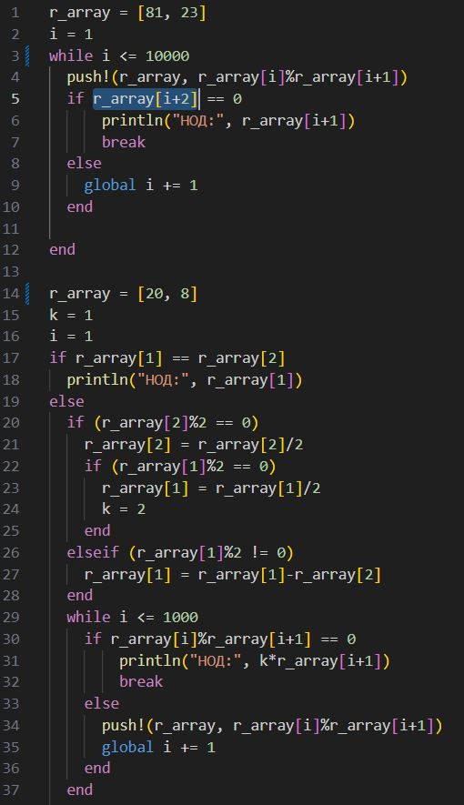
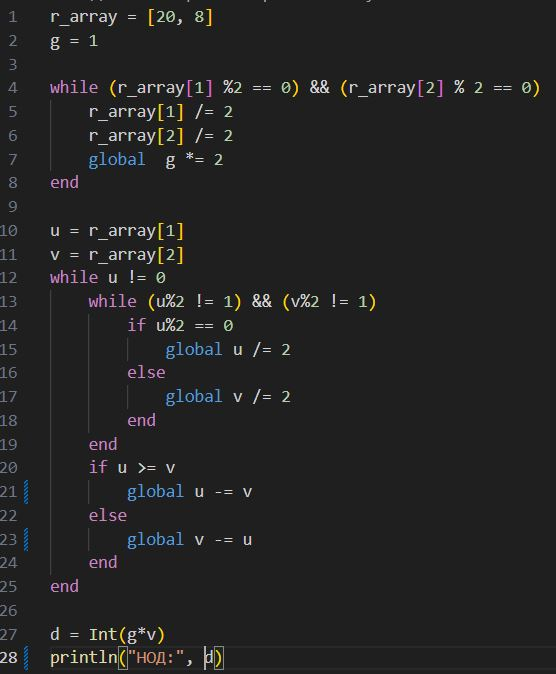
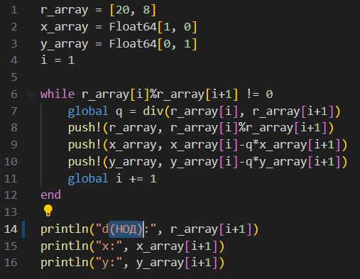
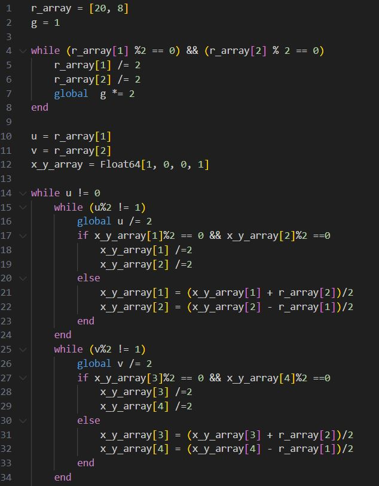
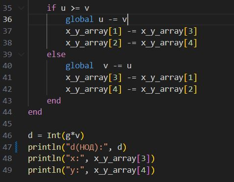

---
## Front matter
lang: ru-RU
title: Математические основы защиты информации и информационной безопасности
author: Супонина Анастасия Павловна
institute: 
    - РУДН, Москва, Россия

date: 
    - 5 Октября 2024

## Formatting
## i18n babel
babel-lang: russian
babel-otherlangs: english

## Formatting pdf
toc: false
toc-title: Содержание
slide_level: 2
aspectratio: 169
section-titles: true
theme: metropolis
header-includes:
 - \metroset{progressbar=frametitle,sectionpage=progressbar,numbering=fraction}
---

# Лабораторная работа 4

## Цель работы

Для нахождения наибольшего общего делителя ознакомиться 4 различными методами и написать программу для каждого из них, а именно для Алгоритма Евклида, Бинарного алгоритма Евклида, Расширенного алгоритма Евклида и Расширенного Бинарного алгоритма Евклида.

## Задание

***Программно реализовать на языке Julia следующие алгоритмы:***

1. Алгоритма Евклида
2. Бинарный алгоритма Евклида
3. Расширенный алгоритм Евклида
4. Расширенный Бинарный алгоритм Евклида

## **Алгоритм Евклида.**	

Общий вид программы

## **Бинарный алгоритм Евклида.**

Общий вид программы

## **Расширенный алгоритм Евклида.**

Общий вид программы

## **Расширенный бинарный алгоритм Евклида.**

Общий вид программы

## Выводы

В процессе выполнения работы, я разобралась с принципом работы алгоритмов Евклида. Реализовала разные виды алгоритмов на языке программирования Julia.

## {.standout}

Спасибо за внимание!
