---
## Front matter
title: "Отчёт по лабораторной работе 4"
author: "Супонина Анастасия Павловна"

## Generic otions
lang: ru-RU
toc-title: "Содержание"

## Bibliography
bibliography: bib/cite.bib
csl: pandoc/csl/gost-r-7-0-5-2008-numeric.csl

## Pdf output format
toc: true # Table of contents
toc-depth: 2
lof: true # List of figures
lot: true # List of tables
fontsize: 12pt
linestretch: 1.5
papersize: a4
documentclass: scrreprt
## I18n polyglossia
polyglossia-lang:
  name: russian
  options:
  - spelling=modern
  - babelshorthands=true
polyglossia-otherlangs:
  name: english
## I18n babel
babel-lang: russian
babel-otherlangs: english
## Fonts
mainfont: IBM Plex Serif
romanfont: IBM Plex Serif
sansfont: IBM Plex Sans
monofont: IBM Plex Mono
mathfont: STIX Two Math
mainfontoptions: Ligatures=Common,Ligatures=TeX,Scale=0.94
romanfontoptions: Ligatures=Common,Ligatures=TeX,Scale=0.94
sansfontoptions: Ligatures=Common,Ligatures=TeX,Scale=MatchLowercase,Scale=0.94
monofontoptions: Scale=MatchLowercase,Scale=0.94,FakeStretch=0.9
mathfontoptions:
## Biblatex
biblatex: true
biblio-style: "gost-numeric"
biblatexoptions:
  - parentracker=true
  - backend=biber
  - hyperref=auto
  - language=auto
  - autolang=other*
  - citestyle=gost-numeric
## Pandoc-crossref LaTeX customization
figureTitle: "Рис."
tableTitle: "Таблица"
listingTitle: "Листинг"
lofTitle: "Список иллюстраций"
lotTitle: "Список таблиц"
lolTitle: "Листинги"
## Misc options
indent: true
header-includes:
  - \usepackage{indentfirst}
  - \usepackage{float} # keep figures where there are in the text
  - \floatplacement{figure}{H} # keep figures where there are in the text
---

# Цель работы

Для нахождения наибольшего общего делителя ознакомиться 4 различными методами и написать программу для каждого из них, а именно для Алгоритма Евклида, Бинарного алгоритма Евклида, Расширенного алгоритма Евклида и Расширенного Бинарного алгоритма Евклида.

# Задание

***Программно реализовать на языке Julia следующие алгоритмы:***

1. Алгоритма Евклида
2. Бинарный алгоритма Евклида
3. Расширенный алгоритм Евклида
4. Расширенный Бинарный алгоритм Евклида

# Теоретическое введение

Для вычисления наибольшего общего делителя двух целых чисел применяется способ повторного деления с остатком называемый алгоритмом Евклида. Рассмотрим действия всех алгоритмов на практике.

# Выполнение лабораторной работы

## 1. **Алгоритм Евклида.**	

    1. Записываю значения a, b в r_array.

  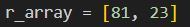

    2. Нахожу остаток от деления. 

  

    3. При полученном значении равном нулю вывожу НОД, в противном случае повторяю ещё раз шаг 2.

  

    4. Вывожу результат.

  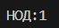

  Бинарный алгоритм Евклида является более быстрым при реализации на компьютере, поскольку использует двоичное представление чисел а и b.  Бинарныи алгоритм Евклида основан на следующих свойствах наибольшего общего делителя (считаем, что $ 0 < b <=а $):

    1. если оба числа а и b четные
    2. если число а — нечетное, а число b — четное
    3. если оба числа а и b нечетные
    4. если а = b

  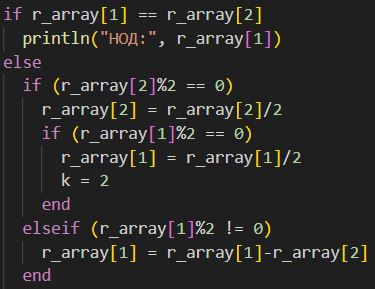

Общий вид программы

2. **Бинарный алгоритм Евклида.**

    1. Записываю g = 1, a, b

  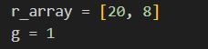

    2. Пока оба числа а и Ь четные, делю их на 2 и умножаю на 2 g при каждой иттерации, до получения хотя бы одного нечетного значения а или b.

  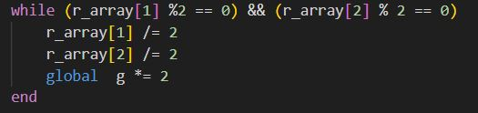

    3. Записываю u и v.

  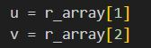

    4. Провожу преобразования пока u не будет равно 0.

  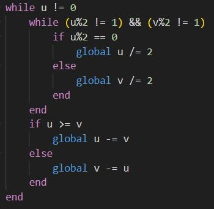

    5. Записываю результат в d.

  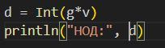

    6. Вывожу результат

  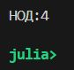

Общий вид программы

3. **Расширенный алгоритм Евклида.**

    1. Записываю значения a, b, а также значения для x и y.

  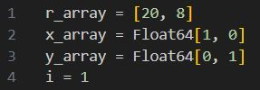

    2. Вычисляю остаток и целочисленное частное от деления.

  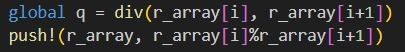

    3. Провожу преобразования пока не получу остаток равный 0.

  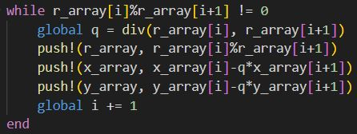

    4. Вывожу результат.

  

Общий вид программы

4. **Расширенный бинарный алгоритм Евклида.**

    1. Записываю g = 1, a, b

  

    2. Пока оба числа а и Ь четные, делю их на 2 и умножаю на 2 g при каждой иттерации, до получения хотя бы одного нечетного значения а или b.

  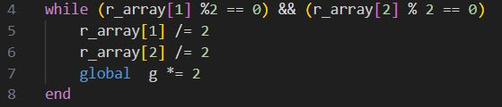

    3. Записываю значения u, v, а также отдельно значения A, B, C и D связанные с u и v.

  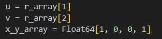

    4. Провожу преобразования пока u не будет равно 0.

        1. Пока u четное.
        2. Пока v четное.
    
  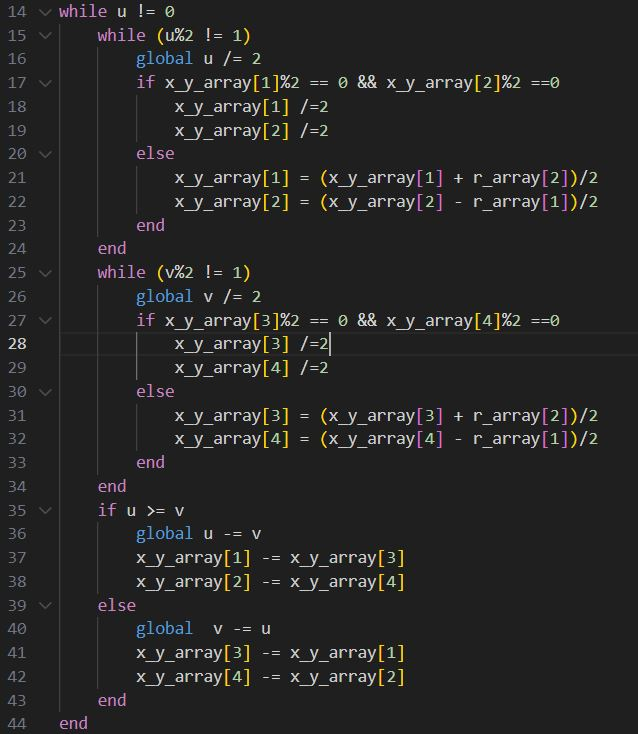

    5. Записываю полученные значения

  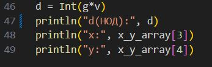

    6. Вывожу результат

  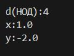

Общий вид программы

# Выводы

В процессе выполнения работы, я разобралась с принципом работы алгоритмов Евклида. Реализовала разные виды алгоритмов на языке программирования Julia.

# Список литературы{.unnumbered}

::: Пособие по лабораторной работе 3 {file:///C:/Users/bermu/Downloads/lab03.pdf}

