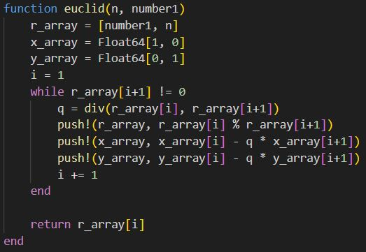
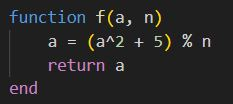
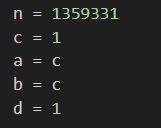
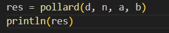

---
## Front matter
lang: ru-RU
title: Математические основы защиты информации и информационной безопасности
author: Супонина Анастасия Павловна
institute: 
    - РУДН, Москва, Россия

date: 
    - 5 Октября 2024

## Formatting
## i18n babel
babel-lang: russian
babel-otherlangs: english

## Formatting pdf
toc: false
toc-title: Содержание
slide_level: 2
aspectratio: 169
section-titles: true
theme: metropolis
header-includes:
 - \metroset{progressbar=frametitle,sectionpage=progressbar,numbering=fraction}
---

# Лабораторная работа 6

## Цель работы

# Цель работы

Изучить $ p $-метод Полларда и научиться его программно реализовывать.

***Задание***

***Программно реализовать на языке Julia $ p $-метод Полларда ***

1. Реализовать алгоритм программно.  
2. Разложить на множители данное преподавателем число. 

## Расширенный алгоритм Евклида

## Функция f

## Входные данные

## р-алгоритм Полланда

## Запуск функции и вывод результата

## Отображение результата

# Выводы

В процессе выполнения работы, я реализовала разложение на множители для заданного числа, а именно реализовала р-алгоритм Полланда на языке программирования Julia.

## {.standout}

Спасибо за внимание!
