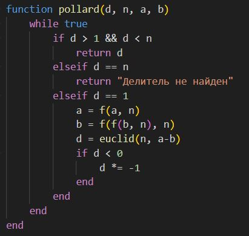

---
## Front matter
title: "Отчёт по лабораторной работе 6"
author: "Супонина Анастасия Павловна"

## Generic otions
lang: ru-RU
toc-title: "Содержание"

## Bibliography
bibliography: bib/cite.bib
csl: pandoc/csl/gost-r-7-0-5-2008-numeric.csl

## Pdf output format
toc: true # Table of contents
toc-depth: 2
lof: true # List of figures
lot: true # List of tables
fontsize: 12pt
linestretch: 1.5
papersize: a4
documentclass: scrreprt
## I18n polyglossia
polyglossia-lang:
  name: russian
  options:
  - spelling=modern
  - babelshorthands=true
polyglossia-otherlangs:
  name: english
## I18n babel
babel-lang: russian
babel-otherlangs: english
## Fonts
mainfont: IBM Plex Serif
romanfont: IBM Plex Serif
sansfont: IBM Plex Sans
monofont: IBM Plex Mono
mathfont: STIX Two Math
mainfontoptions: Ligatures=Common,Ligatures=TeX,Scale=0.94
romanfontoptions: Ligatures=Common,Ligatures=TeX,Scale=0.94
sansfontoptions: Ligatures=Common,Ligatures=TeX,Scale=MatchLowercase,Scale=0.94
monofontoptions: Scale=MatchLowercase,Scale=0.94,FakeStretch=0.9
mathfontoptions:
## Biblatex
biblatex: true
biblio-style: "gost-numeric"
biblatexoptions:
  - parentracker=true
  - backend=biber
  - hyperref=auto
  - language=auto
  - autolang=other*
  - citestyle=gost-numeric
## Pandoc-crossref LaTeX customization
figureTitle: "Рис."
tableTitle: "Таблица"
listingTitle: "Листинг"
lofTitle: "Список иллюстраций"
lotTitle: "Список таблиц"
lolTitle: "Листинги"
## Misc options
indent: true
header-includes:
  - \usepackage{indentfirst}
  - \usepackage{float} # keep figures where there are in the text
  - \floatplacement{figure}{H} # keep figures where there are in the text
---

# Цель работы

Изучить $ p $-метод Полларда и научиться его программно реализовывать.

# Задание

***Программно реализовать на языке Julia $ p $-метод Полларда ***

1. Реализовать алгоритм программно.  
2. Разложить на множители данное преподавателем число. 

# Теоретическое введение

#### Задача разложения составного числа на множители  
Формулируется следующим образом: для данного положительного целого числа $ n $ найти его каноническое разложение:
$$
n = p_1^{a_1} p_2^{a_2} \dots p_s^{a_s},
$$
где $ p_i $ — попарно различные простые числа, $ a_i \geq 1 $.

На практике не обязательно находить каноническое разложение числа $ n $. Достаточно найти его разложение на два нетривиальных сомножителя:  
$$
n = p q, \quad 1 \leq p \leq q < n.
$$  
Далее будем понимать задачу разложения именно в этом смысле.

#### $ p $-Метод Полларда  
Пусть $ n $ — нечетное составное число, $ S = \{0, 1, ..., n - 1\} $, и $ f : S \to S $ — случайное отображение, обладающее сжимающими свойствами, например:  
$$
f(x) = x^2 + 1 \pmod{n}.
$$  
Основная идея метода состоит в следующем:

1. Выбираем случайный элемент $ x_0 \in S $ и строим последовательность $ x_0, x_1, x_2, \dots $, определяемую рекуррентным соотношением:  
   $$
   x_{i+1} = f(x_i),
   $$
   где $ i \geq 0 $, до тех пор, пока не найдем такие числа $ i, j $, что $ i < j $ и $ x_i = x_j $.

2. Поскольку множество $ S $ конечно, такие индексы $ i, j $ существуют (последовательность "зацикливается"). Последовательность $ \{x_i\} $ будет состоять из "хвоста" $ x_0, x_1, ..., x_{l-1} $ длины $ O\left(\sqrt{\frac{\pi n}{8}}\right) $ и цикла $ x_j, x_{j+1}, ..., x_{j-1} $ той же длины.

#### Алгоритм, реализующий $ p $-метод Полларда:  

Вход:  
Число $ n $, начальное значение $ c $, функция $ f $, обладающая сжимающими свойствами.  

Выход:  
Нетривиальный делитель числа $ n $.  

1. Положить $ a \gets c $, $ b \gets c $.  
2. Вычислить:  
   $$
   a \gets f(a) \pmod{n}, \quad b \gets f(f(b)) \pmod{n}.
   $$  
3. Найти:  
   $$
   d \gets \gcd(a - b, n).
   $$  
4. Если $ 1 < d < n $, то положить $ p \gets d $ и вернуть $ p $.  
   Если $ d = n $, результат: "Делитель не найден"; при $ d = 1 $ вернуться на шаг 2.  

#### Пример:  
Найти $ p $-методом Полларда нетривиальный делитель числа $ n = 1359331 $.  
Положим $ c = 1 $ и $ f(x) = x^2 + 5 \pmod{n} $. Работа алгоритма иллюстрируется следующей таблицей:

| $ i $ | $ a $      | $ b $       | $ d = \gcd(a - b, n) $ |  
|--------|-------------|---------------|-------------------------|  
| 1      | 1           | 1             | 1                       |  
| 2      | 6           | 41            | 1                       |  
| 3      | 41          | 123939        | 1                       |  
| 4      | 1686        | 391594        | 1                       |  
| 5      | 123939      | 438157        | 1                       |  
| 6      | 435426      | 582738        | 1                       |  
| 7      | 391594      | 1144026       | 1                       |  
| 8      | 1090062     | 885749        | 1181                    |  

Результат:  
1181 является нетривиальным делителем числа $ 1359331 $.

# Выполнение лабораторной работы

Для использования данного алгоритма необходимо находить НОД, для этого я взяла уже сделанную программу из прошлой лабораторной работы и записала её в виде отдельной функции. А именно, для нахождения НОД я использовала "Расширенный алгоритм Евклида"

При вычисслении значений мы считаем, что у нас есть функция, которая является отображением, я записала её в виде отдельной фкнуии для удобства, само случайное отображение я брала из условия

Далее я прописала все парметры, которые используются для решения данной задачи

После этого я приступила к написанию функции, реализующей р-алгортм Полланда, используя аглоритм описанный в теоретической части, важно заметить, что там присутствует опечатка и когда мы рассчитываем значение параметра b, то примменяем отображение дважды.
Также, так как значение b > a, то при нахождении НОД мы могли получиться отрицательное число, я добавила проверку на отрицательность и в таком случае поставила умножение d на -1

Закончив с написанием функций, я написала последние строки для запуска функции и записи результат её выполнения в переменную res, а после выод резальтата в терминал

Запустив данную программу в терминале я получила следующий вывод, на последним выводом сверзу можно видеть ппредыдущий с проверочными println, которые я использовала для того, чтобы быстро понимать, где расчеты идут неверно

# Выводы

В процессе выполнения работы, я реализовала разложение на множители для заданного числа, а именно реализовала р-алгоритм Полланда на языке программирования Julia.

# Список литературы{.unnumbered}

::: Пособие по лабораторной работе 5 {file:///C:/Users/bermu/Downloads/lab06.pdf}

