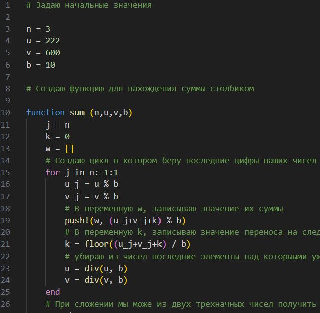
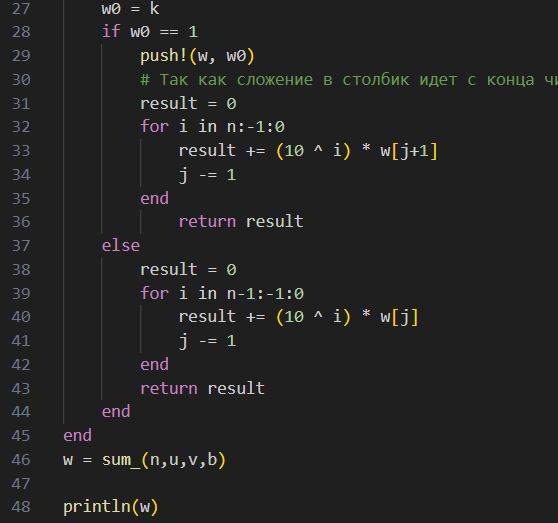
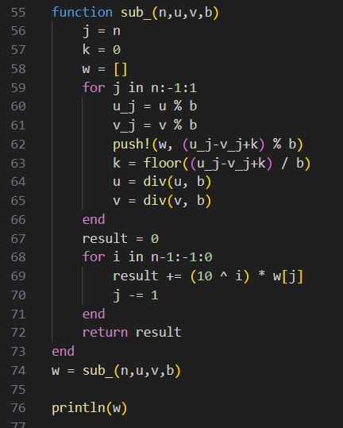
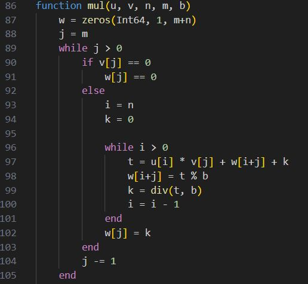
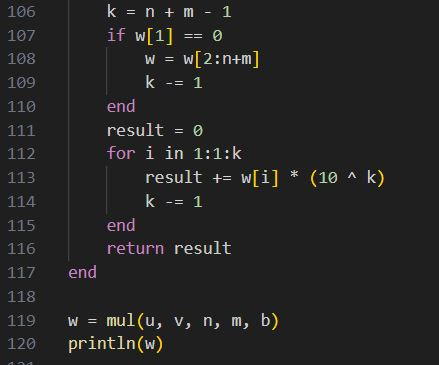
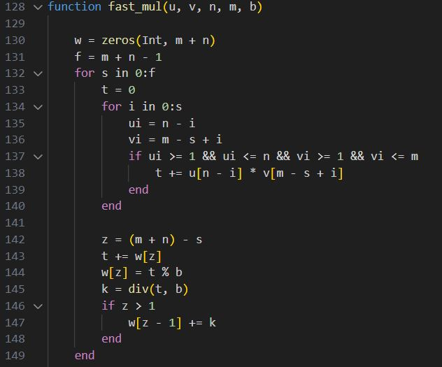
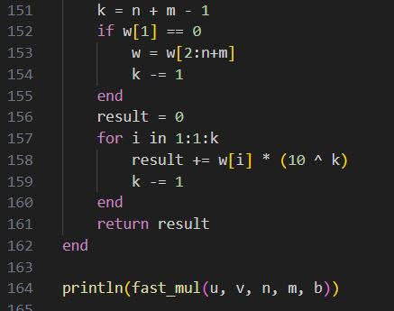
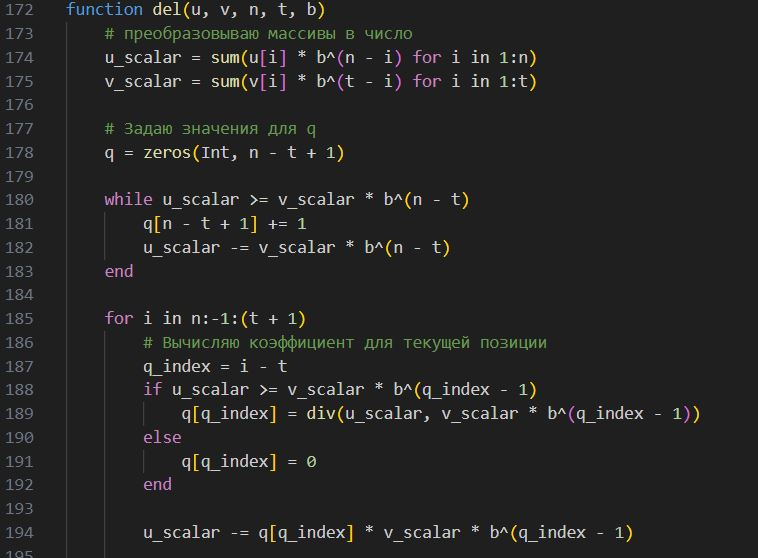
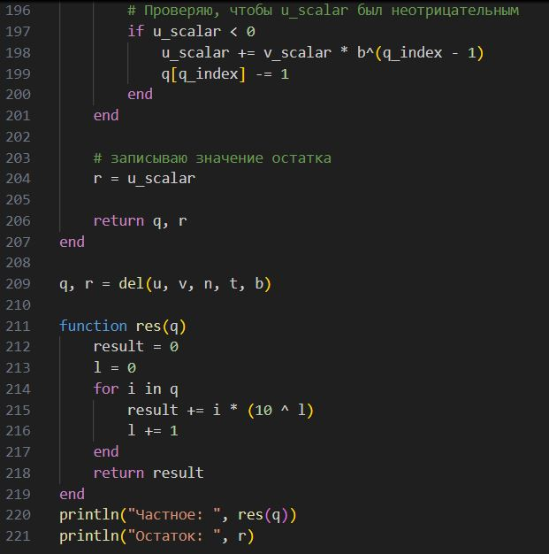

---
## Front matter
lang: ru-RU
title: Математические основы защиты информации и информационной безопасности
author: Супонина Анастасия Павловна
institute: 
    - РУДН, Москва, Россия

date: 
    - 5 Октября 2024

## Formatting
## i18n babel
babel-lang: russian
babel-otherlangs: english

## Formatting pdf
toc: false
toc-title: Содержание
slide_level: 2
aspectratio: 169
section-titles: true
theme: metropolis
header-includes:
 - \metroset{progressbar=frametitle,sectionpage=progressbar,numbering=fraction}
---

## Лабораторная работа 8

### Цель работы

Научиться писать программы для целочисленной арифметики многократной точности.

### Задание

Реализовать следующие алгоритмы для выполнения арифметических операци:
- сложение
- вычитание
- умножение
- упрощенное умножение 
- деление

## Cложение - часть 1

## Cложение - часть 1

## Вычитание

## Умножение - часть 1

## Умножение - часть 1

## Упрощенное умножение - часть 1 

## Упрощенное умножение - часть 1 

## Деление - часть 1

## Деление - часть 1

# Выводы

В процессе выполнения работы, я реализовала алгоритмs сложения, вычитания, умножения двух типов и деления. Таким образом я научилась создавать алгоритмы для выполнения арифметических операций с большими целыми цислами на языке программирования Julia.

